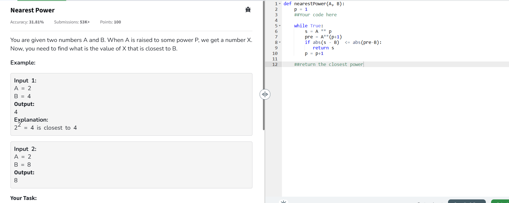

# Array

## 1. Removing Duplicate Entries from Database

As a startup, you have a database of customer information sorted in non-decreasing order. However, there are duplicate entries that need to be removed in-place such that each unique customer appears only once. The relative order of the customers should be kept the same. Write a function that takes in the database as an integer array and returns the number of unique customers in the database after removing duplicates.

Python Function Signature:

```py
def remove_duplicates(database: List[int]) -> int:
# Example 1:

database = [1, 2, 2, 3, 4, 4, 4, 5, 5, 6]
assert remove_duplicates(database) == 6

# Explanation: After removing duplicates, the unique customers are [1, 2, 3, 4, 5, 6], so the function should return 6.

# Example 2:
database = [1, 1, 1, 1, 1, 1, 1]
assert remove_duplicates(database) == 1

# Explanation: After removing duplicates, the unique customer is [1], so the function should return 1.

```

Solution

```py
from typing import List
def remove_duplicates(database: List[int]) -> int:
    # return len(set(database)) 
    t = []
    for i in database:
        if i not in t:
            t.append(i)
    return len(t)
    
database = [1, 2, 2, 3, 4, 4, 4, 5, 5, 6]
assert remove_duplicates(database) == 6

database = [1, 1, 1, 1, 1, 1, 1]
assert remove_duplicates(database) == 1
```

## 2. Stock Trading Profit Maximization

You have been given a list of stock prices of a particular stock. You want to maximize your profit by buying and selling the stock at the right time. On each day, you can either buy the stock, sell the stock, or do nothing. You can only hold at most one share of the stock at any time. However, you can buy it then immediately sell it on the same day. Write a function that takes in a list of stock prices and returns the maximum profit you can achieve. If no profit can be made, return 0.

Python function signature:

```python
def max_profit(prices: List[float]) -> float:
```

Example 1:

```python
prices = [7, 1, 5, 3, 6, 4] 
assert max_profit(prices) == 4.0
```

Example 2:

```python
prices = [7, 6, 4, 3, 1] 
assert max_profit(prices) == 0.0
```

The function should take in a list of stock prices as input and return the maximum profit that can be achieved by buying and selling the stock at the right time. If no profit can be made, the function should return 0.

```py
from typing import List

def max_profit(prices: List[int|float]) -> float:
    if len(prices) < 1:
        return 0.0
        
    max_diff = 0
    pre = prices[0]
    
    for price in prices:
        diff = price - pre
        if diff > max_diff:
            max_diff = diff + 1
        pre = price
    return float(max_diff)
        
        


prices = [7, 1, 5, 3, 6, 4] 
assert max_profit(prices) == 5.0

prices = [7, 6, 4, 3, 1] 
assert max_profit(prices) == 0.0
```

### Array Rotation

Write a function that takes an array and an integer n as input and shifts the array to the right by n steps. Return the shifted array.

Python Function Signature:

```py
def shift_array(arr: List[int], n: int) -> List[int]:

# Example 1:
arr = [1, 2, 3, 4, 5]
n = 2
assert shift_array(arr, n) == [4, 5, 1, 2, 3]
 
# Example 2: 
arr = [0, 1, 2, 3, 4, 5]
n = 4
assert shift_array(arr, n) == [2, 3, 4, 5, 0, 1]
```

----

## GFG | neetcode

### Union of Arrays with Duplicates (Zoho, Rockstand)- Easy

You are given two arrays a[] and b[], return the Union of both the arrays in any order.

The Union of two arrays is a collection of all distinct elements present in either of the arrays. If an element appears more than once in one or both arrays, it should be included only once in the result.

Note: Elements of a[] and b[] are not necessarily distinct.
Note that, You can return the Union in any order but the driver code will print the result in sorted order only.

Examples

```
nput: a[] = [1, 2, 3, 2, 1], b[] = [3, 2, 2, 3, 3, 2]
Output: [1, 2, 3]
Explanation: Union set of both the arrays will be 1, 2 and 3.

Input: a[] = [1, 2, 3], b[] = [4, 5, 6] 
Output: [1, 2, 3, 4, 5, 6]
Explanation: Union set of both the arrays will be 1, 2, 3, 4, 5 and 6.

Input: a[] = [1, 2, 1, 1, 2], b[] = [2, 2, 1, 2, 1] 
Output: [1, 2]
Explanation: Union set of both the arrays will be 1 and 2.
```

```py
class Solution:    
    def findUnion(self, a, b):
        
        return list(set(a)|set(b))
```

### Intersection of two sorted arrays

```

Input: arr1[] = [1, 2, 3, 4], arr2[] = [2, 4, 6, 7, 8]
Output: [2, 4]
Explanation: 2 and 4 are only common elements in both the arrays.
```

```py
class Solution:
    def intersection(self, arr1, arr2):
        return list(sorted(set(arr1) & set(arr2)))
    
```


