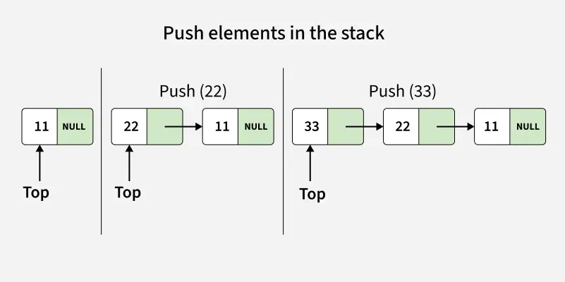
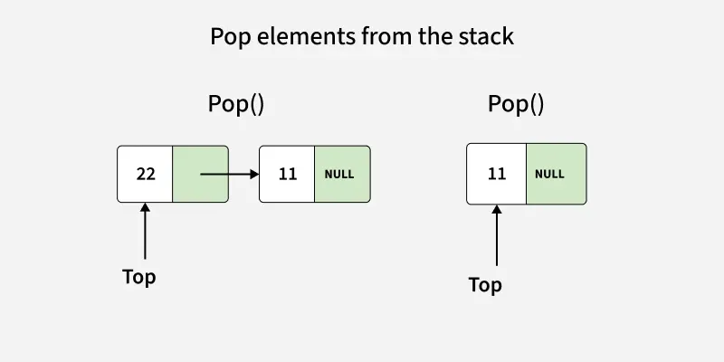

# Stack

A stack is a linear data structure that follows the Last-In/First-Out (LIFO) principle, also known as First-In/Last-Out (FILO).

- This means that the last element added is the first one to be removed.

This means that the last element added is the first one to be removed.

Stack Operations
Stacks support a small set of basic operations, all of which run in O (1) time:

empty (): checks if the stack is empty
size (): returns the number of elements in the stack
top () / peek (): shows the top element without removing it
push(a): adds an element a at the top
pop (): removes the top element

Python does not have a built-in stack type, but stacks can be implemented in different ways using different data structures, let's look at some of the implementations:

1. Using a List
2. Using collections.deque

Stack Implementation using some other Data Structures

- Using queue
- Using Linked-List

1. Using a List
Python lists provide built-in methods that make them suitable for stack operations.
The append () method adds an element to the end of the list.
The pop () method removes and returns the last element from the list.
These operations allow a list to directly support stack-like behavior.

```py
stack = []

stack.append(10)
stack.append(20)
stack.append(30)
stack.append(40)
stack.append(50)

print(stack)

top = stack[-1]

print(top, len(stack))

print(stack.pop())
print(stack)
```

[10, 20, 30, 40, 50]
50 5
50
[10, 20, 30, 40]

2. Using collections.deque
Python�s collections module provides a deque (double-ended queue) for efficient insertions and deletions.
The append () method adds an element to the right end of the deque.
The pop () method removes and returns the element from the right end.
Since deque is optimized for fast appends and pops, it is often preferred over lists for stack implementation.

```py
from collections import deque
stack = deque()

# append() function to push element in the stack
stack.append('a')
stack.append('b')
stack.append('c')

print('Initial stack:')
print(stack)

# pop() function to pop element from stack in LIFO order
print('\nElements popped from stack:')
print(stack.pop())
print(stack.pop())
print(stack.pop())

print('\nStack after elements are popped:')
print(stack)

# uncommenting print(stack.pop()) will cause an IndexError as the stack is now empty
```

List is cash friedly where as deque is not
<https://www.geeksforgeeks.org/python/stack-in-python/>

## Stack - Linked List Implementation

- A stack is a linear data structure that follows the Last-In-First-Out (LIFO) principle
- It can be implemented using a linked list, where each element of the stack is represented as a node.
- The head of the linked list acts as the top of the stack.

### Declaration of Stack using Linked List

A stack can be implemented using a linked list where we maintain:

- A Node structure/class that contains:
  - data → to store the element.
  - next → pointer/reference to the next node in the stack.

- A pointer/reference top that always points to the current top node of the stack.
Initially, top = null to represent an empty stack.

```py
# Node structure
class Node:
    def __init__(self, x):
        self.data = x
        self.next = None


# Stack class
class myStack:
    def __init__(self):
        
        # initially stack is empty
        self.top = None
```

Operations on Stack using Linked List

1. Push Operation
2. Pop Operation
3. Peek (or Top) Operation
4. isEmpty Operation

---

1. Push Operation
Adds an item to the stack. Unlike array implementation, there is no fixed capacity in linked list. Overflow occurs only when memory is exhausted.

- A new node is created with the given value.
- The new node’s next pointer is set to the current top.
- The top pointer is updated to point to this new node.



```py
def push(self, x):
    temp = Node(x)
    temp.next = self.top
    self.top = temp
```

Time Complexity: O(1)
Auxiliary Space: O(1)

2. Pop Operation

Removes the top item from the stack. If the stack is empty, it is said to be an Underflow condition.

Before deleting, we check if the stack is empty (top == NULL).
If the stack is empty, underflow occurs and deletion is not possible.
Otherwise, we store the current top node in a temporary pointer.
Move the top pointer to the next node.
Delete the temporary node to free memory.



```py
def pop(self):
   
    if self.top is None:
        print("Stack Underflow")
        return -1

    temp = self.top
    self.top = self.top.next
    val = temp.data

    del temp
    return val
```
Peek (or Top) Operation
Returns the value of the top item without removing it from the stack.

If the stack is empty (top == NULL), then no element exists.
Otherwise, simply return the data of the node pointed by top.

```py
def peek(self):
 
    if self.top is None:
        print("Stack is Empty")
        return -1
 
    return self.top.data
```
Time Complexity: O(1)
Auxiliary Space: O(1)

isEmpty Operation
Checks whether the stack has no elements.

If the top pointer is NULL, it means the stack is empty and the function returns true.
Otherwise, it returns false.

```py
def isEmpty(self):
    return self.top is None
```