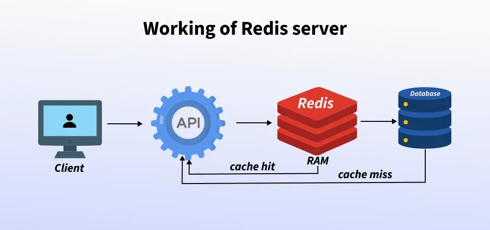

# DB related questions

## What is Radis?

Redis (Remote Dictionary Server)

- It  is a fast database used for in-memory caching to reduce server load by reducing disk and/or network read and write operations.

Uses of Redis are:

- Caching frequently accessed data to improve access time.
- Session storage for web applications
- Managing queues or task lists in background job systems.

It provides a key-value data model, where keys are associated with various data structures like strings, hashes, lists, sets, and more. Redis is designed for high performance, scalability, and simplicity, making it a popular choice for a variety of use cases.

## How Redis Work?

Redis acts as a caching layer between the database and the client to speed up data access and reduce the load on the main database

When a client asks for data, the API Gateway forwards the request to Redis.



- If Redis has the data (cache hit), it returns it quickly through the API Gateway to the client.
- If the data is missing (cache miss), Redis retrieves it from the database, stores it in the cache for future requests, and then passes it back through the API Gateway to the client.
- This flow speeds up response times and reduces the database load

```py
import redis
r = redis.Redis(host='localhost', port=6379, db=0)

r.set('name', 'Alia')
print(r.get('name').decode('utf-8'))  

r.set('name', 'Riya')
print(r.get('name').decode('utf-8')) 

r.delete('name')
print(r.get('name'))
```

## When to Use Redis Server?

- Consider you have a MySQL database and you are constantly querying the database which reads the data from the secondary storage, computes the result, and returns the result.
- If the data in the database is not changing much you can just store the results of the query in redis-server
- instead of querying the database which is going to take 100-1000 milliseconds, you can just check whether the result of the query is already available in redis or not
- return it result which is going to be much faster as it is already available in the memory.
- In a messaging app, Redis can be used to store the last five messages that the user has sent and received using the built-list data structure provided in Redis.

## Why Redis is so Fast?

- Redis is fast because it keeps all its data in memory instead of on disk, so it doesn’t waste time reading from a hard drive.
- Redis uses well-optimized data structures and a simple, lightweight communication protocol called RESP to talk over the network.
- These design choices mean Redis can handle many requests at once, with very little delay, and respond almost instantly.

## RESP in radis

- RESP, or REdis Serialization Protocol, is the wire protocol that Redis clients and servers use to communicate.
- It is a simple, text-based serialization protocol designed specifically for Redis, but usable for other client-server applications.

Key characteristics of RESP:

Serialization of Data Types: RESP supports various data types, including Simple Strings, Errors, Integers, Bulk Strings, and Arrays.

First Byte Determines Type: The type of data in RESP is determined by its first byte:

- for Simple Strings

- for Errors
: for Integers
$ for Bulk Strings

- for Arrays

CRLF Termination: The \r\n (Carriage Return Line Feed) sequence serves as the protocol's terminator, separating different parts of the data.
Binary-Safe: RESP is binary-safe, meaning it can handle any sequence of bytes without issues, unlike some older text-based protocols.
Prefixed Length for Bulk Data: For bulk strings and arrays, RESP uses prefixed lengths to indicate the size of the data, which simplifies parsing and avoids the need to scan for terminators within the data itself.

## Difference Between Redis Vs MongoDB


| Feature | MongoDB | Redis |
|--------|---------|--------|
| Type | Document-based NoSQL database | In-memory key-value store, NoSQL |
| Data Format | Stores data as BSON documents (JSON-like) | Stores data as key-value pairs (strings, sets, lists, hashes, etc.) |
| Storage | Disk-based, persistent storage | Primarily in-memory, optional disk persistence (RDB, AOF) |
| Speed | Slower compared to in-memory stores | Extremely fast due to in-memory storage |
| Persistence | Built-in persistence with automatic backups | Optional persistence via RDB snapshots or AOF logs |
| Querying | Supports complex queries with rich operators ($gt, $lt, $regex, etc.) | Limited querying capabilities (basic key-value operations) |
| Best Use Cases | Large datasets, complex queries, rich document structures | Caching, real-time analytics, messaging, high-speed applications |
| Complexity | More complex to manage and scale | Simple to use, optimized for low-latency scenarios |


Step 1: Install Redis Using pip

```
pip install redis
pip show redis

```
