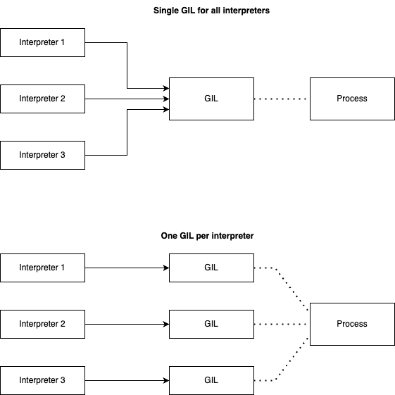

# Python 3.12

Python 3.12 was released on October 2nd, 2023.

1. Syntactic formalization of f-strings - more flexible f-strings
2. A per-interpreter GIL - take full advantage of multiple CPU cores
3. Better error messages - hints for mistakes like not importing a module from the standard library
4. Improved typing
    - Using `TypedDict` for more precise `**kwargs` typing
    - Override decorator for static typing
5. Comprehension inlining - faster list/dict/set comprehensions

----

## Syntactic Formalization of F-Strings

switch between single and double

```py
friends = ["Rolf", "Bob", "Jen", "Anne"]
print(f"I invited: {", ".join(friends)}")


"""
    print(f"I invited: {", ".join(friends)}")
                         ^
SyntaxError: f-string: expecting '}'
"""
```

you'd need to update your code like:

```py
friends = ["Rolf", "Bob", "Jen", "Anne"]
print(f'I invited: {", ".join(friends)}')


# I invited: Rolf, Bob, Jen, Anne
```

You can now also use comments and multiline expressions inside f-strings:

```py
users = [{"id": 1, "name": "John"}, {"id": 2, "name": "Jane"}]


print(
    f"User IDs: {", ".join([str(user["id"]) for user in users])
    # We need to convert IDs to string because join expects string.
    }"
) # o/pUser IDs: 1, 2
```

Note:
 be careful to not introduce too much complexity into your f-strings. It's easy to go overboard and make them unreadable.

## A Per-Interpreter GIL

The Global Interpreter Lock (GIL) is a mutex (or lock) that protects access to Python objects, preventing multiple threads from executing Python bytecodes at once.

This lock is necessary mainly because CPython's memory management is not thread-safe.

The GIL is controversial because it prevents multithreaded CPython programs from taking full advantage of multiprocessor systems in certain situations.

Python 3.12 introduces a per-interpreter GIL. This change will allow Python to take full advantage of multiple CPU cores.

Python 3.12 will only support the per-interpreter GIL through the C-API



## Better Error Messages

Python 3.12 also brings better error messages. This time, it's about hints for resolving the errors with suggestions like

    "Did you mean..."
    "Did you forget..."
    "Did you mean to use..."

Let's take a look at some examples...

```py
if os.getenv("DEBUG"):
    print("Debugging is on")


"""
Traceback (most recent call last):
  File "<stdin>", line 1, in <module>
NameError: name 'os' is not defined. Did you forget to import 'os'?
"""
```

Improved error suggestions for `NameError` exceptions for instances:

```py
class User:
    def __init__(self, first_name, last_name):
        self.first_name = first_name
        self.last_name = last_name
    def full_name(self):
        return f"{self.first_name} {last_name}"


user = User("Jan", "Smith")
print(user.full_name())


# NameError: name 'last_name' is not defined. Did you mean: 'self.last_name'?
```

Improved `SyntaxError` error message when the user types import x from y instead of from y import x:

```py
import datetime from datetime

# SyntaxError: Did you mean to use 'from ... import ...' instead?
```

ImportError exceptions raised from failed from <module> import <name> statements now include suggestions for the value of <name> based on the available names in <module>:

```py
from datetime import TimeDelta

# ImportError: cannot import name 'TimeDelta' from 'datetime'. Did you mean: 'timedelta'?
```

## Improved Typing

The first one is the ability to better type `kwargs` with `TypedDict`. Have you ever tried to type `kwargs` that were of different types? I bet you ended up with Any or some other sub-optimal solution. Function signatures, as introduced by PEP-484, allowed type annotations for `kwargs` only if they were of the same type. This could be very annoying, when you try to type a bit more evolved codebase. Fortunately, Python 3.12 comes with support to type `kwargs` with different types by using `TypedDict`:

```py
from typing import TypedDict, Unpack


class OAuthState(TypedDict):
  name: str
  user_id: int
  is_internal: bool


def redirect_to_idp(**kwargs: Unpack[OAuthState]):
```

Another improvement worth mentioning is the `@override` decorator. Have you ever tried to override some method to extend behavior of a class and end up scratching your head when things don't work as expected? This sure has happened to me. For example, I wanted to extend the behavior of a Django REST Framework view, but something was off. It took me quite some time to realize that my method that should override `put` was called `putt`. Python 3.12 introduces protection for that via the `@override` decorator. If a method is decorated with `@override`, Python type checkers will check if the method is actually overriding something. If not, it will raise an error. This is how it works:

```py
from typing import override


class Cat:
    def meow(self) -> str:
        return "meow"


class EgyptianCat(Cat):
    @override  # ok: overrides Cat.meow
    def meow(self) -> str:
        return "meow meow"


class PersianCat(Cat):
    @override  # type checker error: does not override Cat.mew
    def mew(self) -> str:
        return "meow mew"

# mypy error
# error: Method "mew" is marked as an override, but no base method was found with this name  [misc]
```

## Comprehension Inlining

Python 3.12 also brings a new optimization for list/dict/set comprehensions. Comprehensions are now inlined, which means that they are faster. Instead of creating a new single-use function for each execution, comprehensions are now inlined. This speeds up comprehensions up to 2
