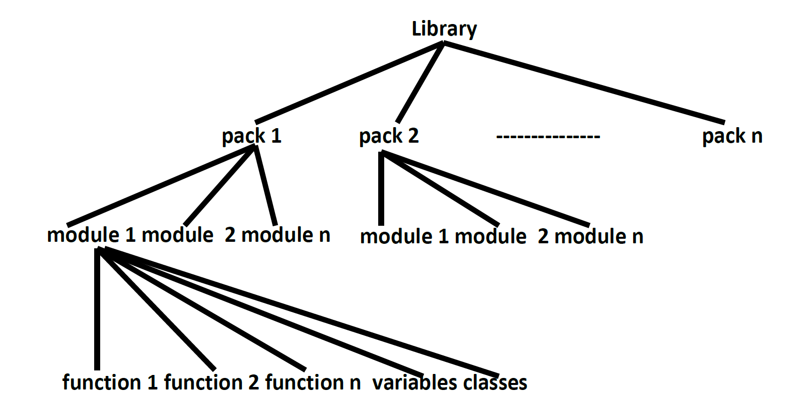

# PACKAGES

## Functions

- A Group of repeatedly required lines.
- Code reusability

## Modules

- Python files
- A group of functions, variables, classes saved to a file.

## Packages

- A collection of related modules into a folder
- A collection of related modules into a single unit.
- It is an encapsulation mechanism to group related modules into a single unit.
- package is nothing but folder or directory
- - Any folder or directory contains __init__.py file, is considered as a Python package.
  - This file can be empty.
- A package can contain sub packages also.

*__Note:__*

- From pythin 3.3  version onwords, it is not mandatory `__init__.py` (optional)
- but Good to use it

### The main advantages of package are

1. We can resolve naming conflicts
2. We can identify our components uniquely
3. It improves the modularity of the application
4. It improves readability and maintainability of the application

Get tree directory

```yaml
tree /f`
   Eg 1: D:\Python_cla>
            |-test.py
            |-pack1
              |-module1.py
              |-__init__.py

```


## Libray vs Package vs Module vs Function

- Function: A Group of repeatedly required lines of code.
- Module: A group of functions, variables, classes saved to a file.
- Packages: A group of related modules into a single unit. It contains sub packages.
- Library: A group of packages.
Note: Summary diagram of a library, packages, modules which contains functions, classes and variables.


## Importance of __init__.py

  At the time of using a package, If we want to perform any initialization activities *__automatically__*, then we have to go for __init__.py
  
### Need of installing a package

- If we want to use a packages, compulsory it should be available in the current working directory.
- To make package available through out our system then we have to install that package.

#### exec()

- Execute the given source in the context of globals and locals.  
- The source may be a string representing one or more Python statements or a code object as returned by compile()

```py
exec(""" 
        import string
        print(string.ascii_letters) """)
```

Once we are installed, we can access that package from anywhere in our system.

### How to install a package

setuptools package

setup.py :-> setup()

#### pip

pip is a python package management system to install and mange software written in python

- pip => Python
- npm => JavaScript
- apt => Ubuntu
- yum => redhat linux

pip install .

- Where setup.py is located

eg:
way-1
pip install setuptools :=> not a inbuilt module

1. using built package `pip install --upgrade build`

2. code

    ```py
   from setuptools import setup
    setup(
        name='mypackage',
        version='0.0.1',
        install_requires=[
            'requests',
            'importlib-metadata; python_version<"3.10"',
        ],
    )
    ```

3. python -m build
4. installtion

```commandline
python setup.py install 
        or  
pip install .
        or
pip install dist\ashish-0.0.1-py3-none-any.whl
```

Note:
 recommend users to expose as much as possible configuration in a more declarative way via the pyproject.toml or setup.cfg, and keep the setup.py minimal

way-2 easy way
    - from setuptools import setup

```yaml
setup(
    name='ashish',
    version='0.0.1',
    packages=['ashish'],
    install_requires=[],
)
```

- `pip install ashish`

3rd way an Alternative way
    - from setuptools import setup, find_packages

```yamls
setup(
    name='ashish',
    version='0.0.1',
    packages=find_packages(),  # __init__.py is mandatory for this
    install_requires=[],
)
```

- `pip install ashish`

we can give url also

### pyproject.toml

it will also work

```sh
[project]
name = "ashish"
version = "0.0.1"
dependencies = []
```

- python -m build
- pip install .

can we

### setup.cfg

```yaml
[metadata]
name = mypackage
version = 0.0.1

[options]
install_requires =
    requests
    importlib-metadata; python_version<"3.10
```
