# Intro to Stramlit

Streamlit is an opensource app framework for Machine Leaning and Data Science projects. It Allows you to create beautiful web applications for your achine leaning and data science projects with simple python scrips.

- A Faster wav to build and share data apps

- Purealy based on python

we are write code 2 types

1. Inpretive code
2. Declarative code:- eg yaml, tom

- declartiver not reqired html, css, js

## To Display messages

```py
import streamlit as st

st.title("Hello Chat App")
st.subheader("Brewed with streamlit")
st.text("Welcome to your first application")
st.write("choose your fav variety of chai")
```

### output

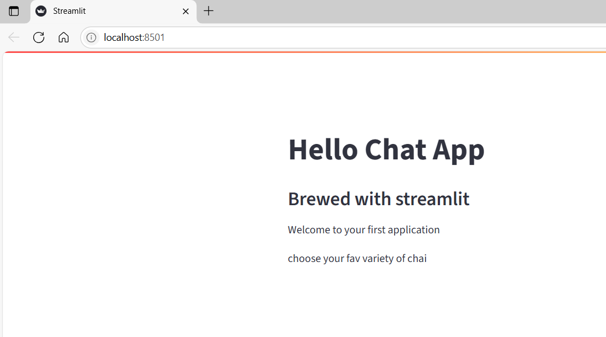

### For title

`st.title("hello title")`

### To display a sample text

```py
st.write("This is sample text!!")
```

## How to run streamlit application

`streamlit run app.py`

## Select box

```py
chai = st.selectbox("Your fav  chai: ", ["Masala chai", "Lemon Tea", "Adrak chai", "kesar Chai"])

st.write(f"Your choose {chai}. Excellent choise")
st.success("Your chai has been brewed!")
```

### output

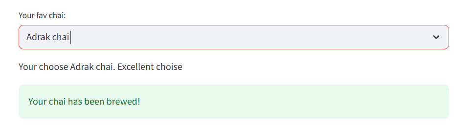

## conditional

### if with success msg

```py
import streamlit as st

st.title("Cahi Maker App")

if st.button("Make Chai"):
    st.success("Your chai is being brewed")
```

Output:

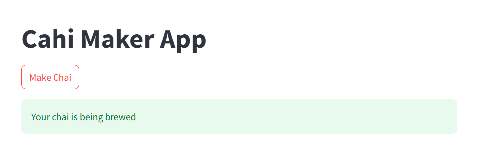

### check box

```py
add_masala = st.checkbox("Add Masala")

if add_masala:
    st.write("Masala added to your chai")
```

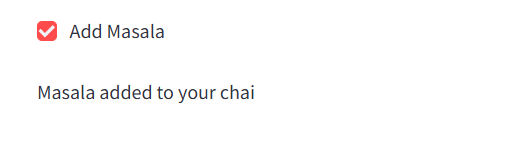

### radio button

```py
tea_type = st.radio("Pick your chai base: ", ["Milk", "Water", "Almond Milk"])

st.write(f"Select base {tea_type}")
```

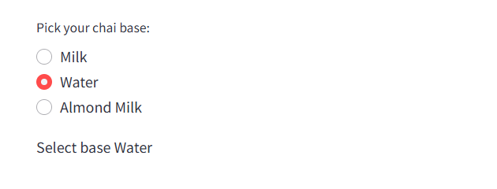

### select and slider

```py
flavour = st.selectbox("Choose flavour ", ["Adrak", "Kesar", "Tulsi"] )

sugar = st.slider("Sugar level", 0, 5, 2)
```

output
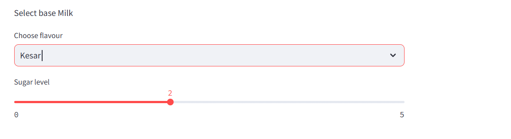

### numbers

```py
cups = st.number_input("How many cups", min_value=1, max_value=10, step=2)
st.write(f"Selected sugar level {cups}")
```

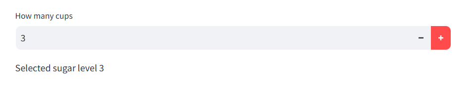

## input

```py
name = st.text_input("Plz ender your name")

if name:
    st.write(f"We {name}, Your chai is on the way")
```

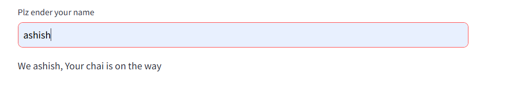

```py
dob = st.date_input("Select your date of birth")
st.write(f"Your date of birth {dob}")
```

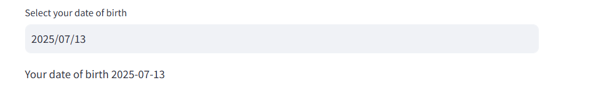

## plit the page

```py
import streamlit as st

col1, col2 = st.columns(2)

with col1:
    st.header("Masala Chai")
    
    vote1 = st.button("Vote Masala Chai")

with col2:
    st.header("Adrak Chai")
    vote2 = st.button("Vote Adrak Chai")

if vote1:
    st.success("Thanks for voting masala chai")

elif vote2:
    st.success("Thanks for voting Adrak Chai")
```

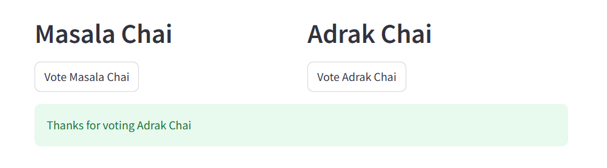

```py

with col2:
    st.header("Adrak Chai")
    st.image("https://images.pexels.com/photos/28052357/pexels-photo-28052357.jpeg", width=200)
    vote2 = st.button("Vote Adrak Chai")

```

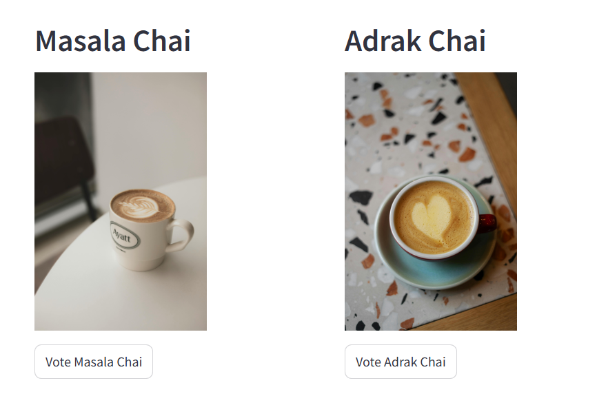

### sidebar

```py
    

name = st.sidebar.text_input("Enter your name")
tea = st.sidebar.selectbox("Choose your chai", ["Masala", "kesae", "Adrak"])

st.write(f"Welcome {name} and your {tea} chai is getting ready")

```

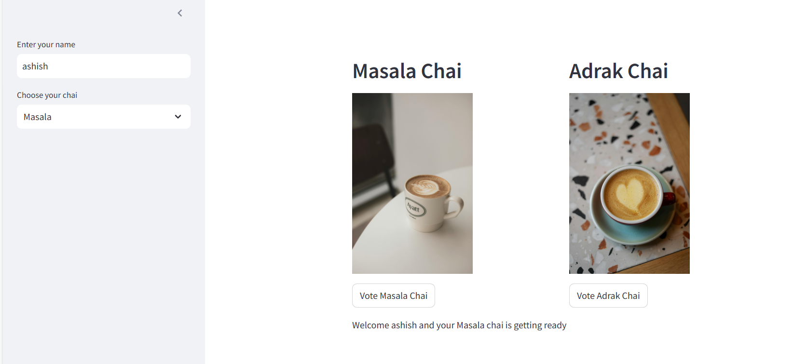

### Expander

```py
with st.expander("show chai Making Instructions"):
    st.write(
        """
             1. Boil water with tea leaves
             2. Add milk and spices
             3. Serve hot
        """
    )
```

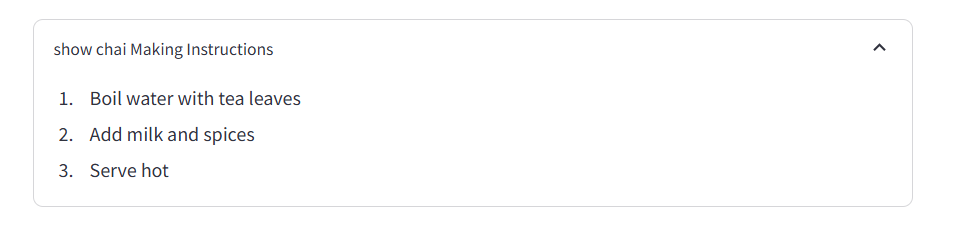

### makdow

```py
st.markdown("""
            ## test
            
            > new row
            """)
```

## file upload

```py
import streamlit as st
import pandas as pd

st.title("Chai Sale Dashboard")

file = st.file_uploader("Upload your csv file", type=['csv'])

if file:
    df = pd.read_csv(file)
    st.subheader("Data Preview")
    st.dataframe(df)

if file:
    st.subheader("Summary Stats")
    st.write(df.describe())
```

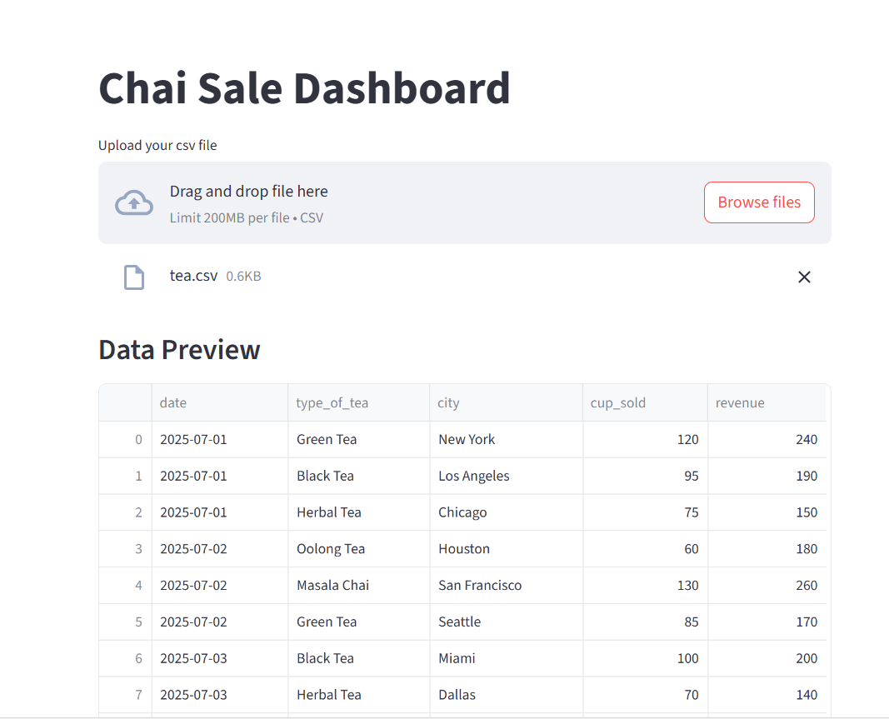
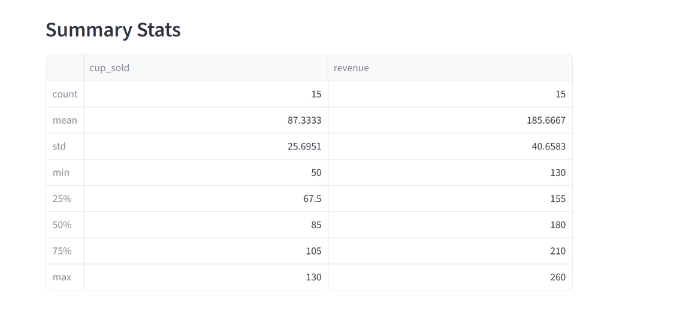

## filter data

```py
if file:
    cities = df["city"].unique()
    selected_city = st.selectbox("Filter  by cites", cities)
    
    
    filtered_data = df[df["city"] == selected_city]
    st.dataframe(filtered_data)

```

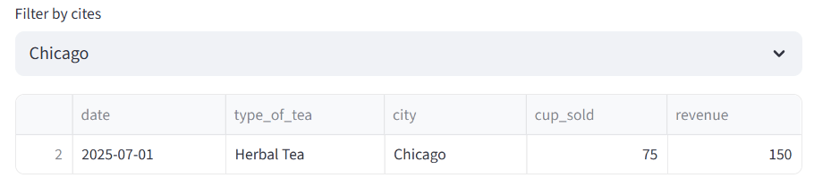

## Display the Dataframe

### Create a simple Dataframe

```py
df = pd.DataFrame({
    "first column": [1,2,3,4],
    "secound coulmn": [10,20,30,40]
})

st.write("Here is the dataframe")
st.write(df)
```

## Create a line chart

```py
chart_data = pd.DataFrame(
    np.random.randn(10,3), columns = ['a','b','c']
)

st.line_chart(chart_data)
```

## Happ Birthday

```py
st.title("Happy Birthday!!")

st.balloons()
```

## One line code display

```py
st.text("Display Row Code")
st.code("import numpy as np")
```

## Display row code with dataframe

```py
with st.echo():
    import pandas as pd
    df = pd.DataFrame()
```

## Progress bar

```py
import time
my_bar = st.progress(0,text="this is progress")
for p in range(100):
    time.sleep(1)
    my_bar.progress(p+10)
```

## spinner

```py
with st.spinner("waiting...."):
    time.sleep(3)

st.success("Sucessful!!")
```

## side bar

```py
# Sidebar
st.sidebar.header("About")
st.sidebar.title("This is our demo Project")

algorithms = st.sidebar.selectbox("Your Alogorithm",["Liner Regration","Logistic Regration", "dession tree"])
```

## Selector

```py
occupation = st.selectbox("Your Occuption", ["programmer","data scientist", "Doctor", "Businessman"])
st.write("you Selected this option", occupation)
```

## Miltiselect

```py
location = st.multiselect("Where do you work", ("pbi","mumbai", "punjaie","delhi"))
st.write("You selected", len(location), "locations")
```

## Display JSON Output

```py
st.text("Display JSON Data")
st.json({
    "Name": "Shivan",
    "Gender": "Male"})
```

status = st.radio(")
