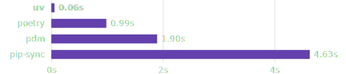

# UV

An extremely fast Python package and project manager, written in Rust.


🚀 A single tool to replace pip, pip-tools, pipx, poetry, pyenv, twine, virtualenv, and more.

installtion

`pip install uv`

## comparision

### old way

make a folder

```sh
mkdir old_way
cd old_way
python -m venv .venv

venv\Screipt|activate
pip install flask requests

pip freeze > requirments.txt
```

### using UV

```sh
uv init new_app
or
uv init
or 
uv init --app 
or 
uv init --lib 

cd new_app


```

by default it create following files

uv atomatically insilize a .git repostory for us 
.python-version file it also have python version file, which conatian consist python version
```
```